<!-- Graphics in assets/svg are generated by tools/readme-gfx (node build.mjs ../../assets/svg) -->

<div align="center">
  
</div>

<div align="center">
  <a href="https://git.io/typing-svg">
    
  </a>
</div>

<div align="center">

[](https://github.com/jordzcahn)
[](https://cahngames.github.io)
[](https://github.com/jordzcahn?tab=followers)

</div>


<!-- ═══════════════════════════ ABOUT ME ═══════════════════════════ -->



I'm a game developer from Johannesburg who likes shipping things people can actually play. I study Game Design & Development at Vega and run **Cahn Games**, my indie studio. My first mobile title, **Mothlight**, is on its way to the App Store.

<div align="center">
  
</div>

<details>
<summary><b>📜 player.yaml</b> (fun facts)</summary>

```yaml
name: Jordan Cahn
alias: ["Jordz", "Jordy", "Jords"]
location: Johannesburg, South Africa 🇿🇦
education: Game Design & Development (2nd Year), Vega School (The IIE)
studio: Cahn Games (Founder)
business: Cahn Tech Solutions (IT Support, on-site & remote)
dream: Lead dev on an open-world simulation game
fun_facts:
  - Night owl who codes best after midnight 🦉
  - Fuelled by pasta and good coffee ☕
  - Will talk endlessly about Afro House & Black Coffee 🎵
motto: "In a world full of bugs, be the debug."
```

</details>

<br/>

<!-- ═══════════════════════════ NOW BUILDING ═══════════════════════════ -->


### 🦋 Mothlight &nbsp;·&nbsp; <sub>Coming soon to iOS</sub>

<div align="center">
  
</div>

**A one-touch orbit-hopping arcade game.** Circle the lamp, tap to hop between orbits and stay off the thorns. It started as a prototype I'd been making for a while, and it's now Cahn Games' first release.

`Unity 6` `C#` `iOS` `Android`

<div align="center">
  
  &nbsp;
  
  &nbsp;
  
</div>

<p align="center"><a href="https://cahngames.github.io"><b>🌐 cahngames.github.io</b></a></p>

<br/>

### 🚗 RAMJAW: Arena Wreckers &nbsp;·&nbsp; <sub>Coming to Steam</sub>

<div align="center">
  
</div>

**Drift. Ram. Wreck. Repeat.** Fast, loud arcade car combat: survive endless waves of armed cars and bosses, then settle scores with a friend in couch split-screen.

`Unity 6` `C#` `PC`

<br/>

### 🎓 Also on the go

<table>
<tr>
<td width="50%" valign="top">

**🏛️ Succession**
`Unreal Engine 5` `Blueprints`
> Third-person level built in UE5 for GADE7222: a hand-built map, materials and Blueprint movement tweaks.

</td>
<td width="50%" valign="top">

**🧠 Habitual v3.0**
`HTML` `CSS` `JavaScript`
> PWA habit tracker with a full XP/levelling system, achievements and a heatmap calendar.
> [Live Demo →](https://jordzcahn.github.io/habittracker)

</td>
</tr>
</table>

<details>
<summary><b>📂 Earlier Projects (click to expand)</b></summary>
<br/>

| Project | Tech | What it is |
|---------|------|------------|
| 🏃 **Interference** | Unity 6 · C# | Cyberpunk 3D endless runner (individual prototype) |
| 📡 **Interference Group Prototype** | Unity · C# | Group project with Aidan, growing the Interference concept into a multi-level game (GADE6221) |
| 🏎️ **Full Throttle** | Unity · C# | Arcade racer prototype with a lap system, live HUD, mini-map, garage and missions |
| 🕹️ **Gravity Switcher** | Unity 2D | Game-jam rage platformer with a gravity-flip mechanic, made with Adrian, Tristan & Aidan |
| 📁 **File Organizer** | C# · .NET 8 | Console app that sorts your Downloads folder by file type, with preview & confirm |
| 🗡️ **Console Dungeon** | C# WinForms (ASCII) | Roguelike dungeon crawler (GADE6122 POE) |
| 🐉 **Dragon Battle** | C# WinForms | Turn-based battle system (GADE5121 POE) |
| 🐦 **Flap Jack** | HTML / JS | Flappy Bird clone with skins, a day/night cycle and a shop |
| 💣 **RED STORM** | HTML / JS | Browser-based C&C-style RTS |
| 🎲 **Board Game + Digital Companion** | Mixed | Hybrid physical/digital game experience |

</details>

<br/>

<!-- ═══════════════════════════ TECH STACK ═══════════════════════════ -->


<div align="center">

**Engines & languages**<br/><br/>


<br/><br/>**Tools**<br/><br/>


<br/><br/>**Shipping to**<br/><br/>


**Languages I speak:** English (native) · Afrikaans

</div>

<br/>

<!-- ═══════════════════════════ ROADMAP ═══════════════════════════ -->


<div align="center">
  
</div>

<br/>

<!-- ═══════════════════════════ CONTRIBUTIONS ═══════════════════════════ -->


<div align="center">

<picture>
  <source media="(prefers-color-scheme: dark)" srcset="https://raw.githubusercontent.com/jordzcahn/jordzcahn/output/github-snake-dark.svg" />
  <source media="(prefers-color-scheme: light)" srcset="https://raw.githubusercontent.com/jordzcahn/jordzcahn/output/github-snake.svg" />
  
</picture>

</div>

<br/>

<!-- ═══════════════════════════ CONNECT ═══════════════════════════ -->



<div align="center">

[](https://cahngames.github.io)
[](https://github.com/jordzcahn)
[](https://jordzcahn.github.io/habittracker)
<!-- Add your socials below when ready -->
<!-- [](https://linkedin.com/in/YOUR_USERNAME) -->
<!-- [](https://YOUR_USERNAME.itch.io) -->

</div>

<br/>

<div align="center">


**⚡ Drop a ⭐ if you like what you see, or just vibe with the chaos.**

</div>
