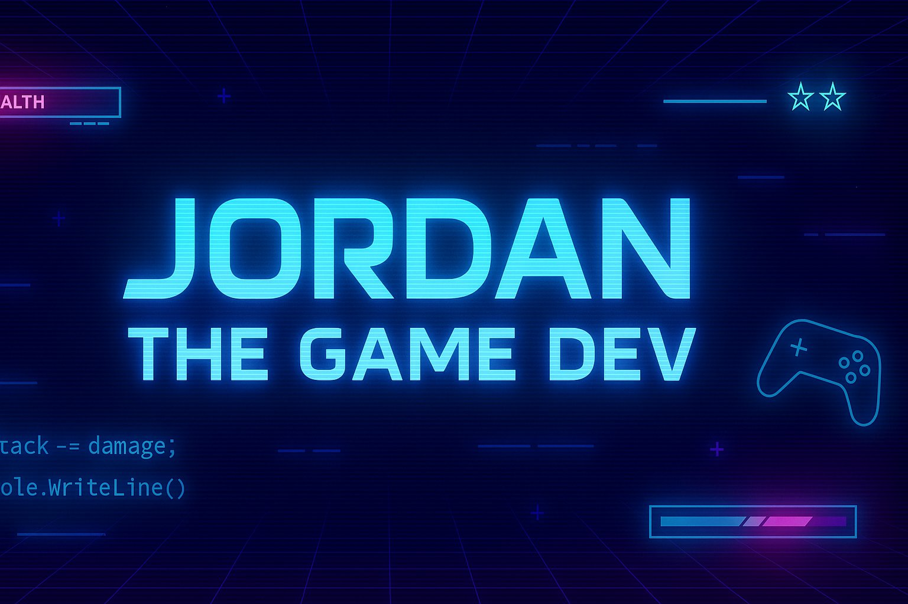
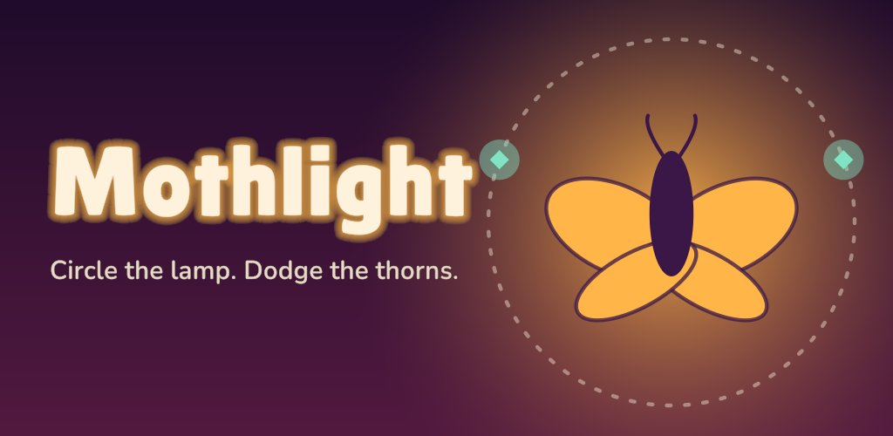
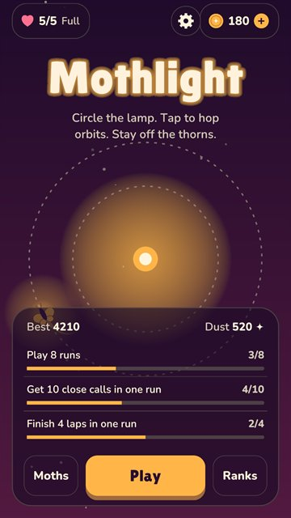
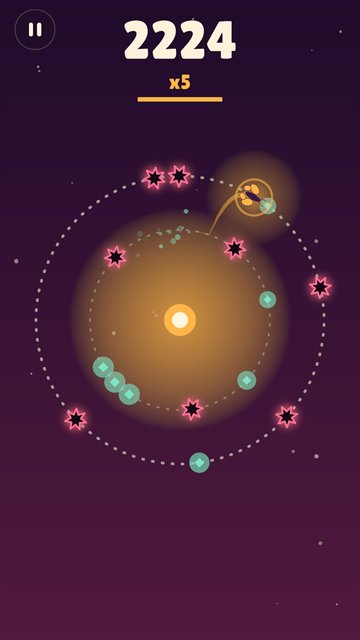
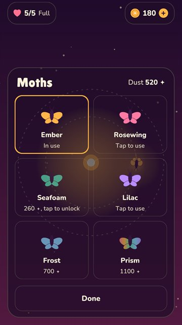

<!-- ═══════════════════════════════════════════════════════════════════════ -->
<!-- HEADER -->
<!-- ═══════════════════════════════════════════════════════════════════════ -->


<div align="center">
  
</div>

<div align="center">
  <a href="https://git.io/typing-svg">
    
  </a>
</div>

<div align="center">

[](https://github.com/jordzcahn)
[](https://cahngames.github.io)
[](https://github.com/jordzcahn?tab=followers)

</div>

<br/>

<!-- ═══════════════════════════════════════════════════════════════════════ -->
<!-- ABOUT ME -->
<!-- ═══════════════════════════════════════════════════════════════════════ -->


##  &nbsp;About Me

I'm a game developer from Johannesburg who likes shipping things people can actually play. I study Game Design & Development at Vega and run **Cahn Games**, my indie studio. My first mobile title, **Mothlight**, is on its way to the App Store.

```yaml
name: Jordan Cahn
alias: ["Jordz", "Jordy", "Jords"]
location: Johannesburg, South Africa 🇿🇦

studio:
  name: Cahn Games
  role: Founder & developer
  site: cahngames.github.io
education:
  degree: Game Design & Development (2nd Year)
  institution: Vega School (The IIE)
business:
  name: Cahn Tech Solutions
  role: Founder
  services: IT Support (On-site & Remote)

currently:
  - Launching Mothlight on iOS 🦋
  - Getting RAMJAW ready for Steam 🚗💥
  - Levelling up in Unreal Engine 5 🧱
dream: Lead dev on an open-world simulation game

fun_facts:
  - Night owl who codes best after midnight 🦉
  - Fuelled by pasta and good coffee ☕
  - Will talk endlessly about Afro House & Black Coffee 🎵
motto: "In a world full of bugs, be the debug."
```

<br/>

<!-- ═══════════════════════════════════════════════════════════════════════ -->
<!-- FEATURED PROJECTS -->
<!-- ═══════════════════════════════════════════════════════════════════════ -->

##  &nbsp;What I'm Building

### 🦋 Mothlight &nbsp;·&nbsp; <sub>Coming soon to iOS</sub>

<div align="center">
  
</div>

**A one-touch orbit-hopping arcade game.** Circle the lamp, tap to hop between orbits and stay off the thorns. It started as a prototype I'd been making for a while, and it's now Cahn Games' first release.

`Unity 6` `C#` `iOS` `Android`

<div align="center">
  
  &nbsp;
  
  &nbsp;
  
</div>

<p align="center"><a href="https://cahngames.github.io"><b>🌐 cahngames.github.io</b></a></p>

<br/>

### 🚗 RAMJAW: Arena Wreckers &nbsp;·&nbsp; <sub>Coming to Steam</sub>

**Drift. Ram. Wreck. Repeat.** Fast, loud arcade car combat: survive endless waves of armed cars and bosses, then settle scores with a friend in couch split-screen.

`Unity 6` `C#` `PC`

<br/>

### 🎓 Also on the go

<table>
<tr>
<td width="50%" valign="top">

**🏛️ Succession**
`Unreal Engine 5` `Blueprints`
> Third-person level built in UE5 for GADE7222: a hand-built map, materials and Blueprint movement tweaks.

</td>
<td width="50%" valign="top">

**🧠 Habitual v3.0**
`HTML` `CSS` `JavaScript`
> PWA habit tracker with a full XP/levelling system, achievements and a heatmap calendar.
> [Live Demo →](https://jordzcahn.github.io/habittracker)

</td>
</tr>
</table>

<details>
<summary><b>📂 Earlier Projects (click to expand)</b></summary>
<br/>

| Project | Tech | What it is |
|---------|------|------------|
| 🏃 **Interference** | Unity 6 · C# | Cyberpunk 3D endless runner (individual prototype) |
| 📡 **Interference Group Prototype** | Unity · C# | Group project with Aidan, growing the Interference concept into a multi-level game (GADE6221) |
| 🏎️ **Full Throttle** | Unity · C# | Arcade racer prototype with a lap system, live HUD, mini-map, garage and missions |
| 🕹️ **Gravity Switcher** | Unity 2D | Game-jam rage platformer with a gravity-flip mechanic, made with Adrian, Tristan & Aidan |
| 📁 **File Organizer** | C# · .NET 8 | Console app that sorts your Downloads folder by file type, with preview & confirm |
| 🗡️ **Console Dungeon** | C# WinForms (ASCII) | Roguelike dungeon crawler (GADE6122 POE) |
| 🐉 **Dragon Battle** | C# WinForms | Turn-based battle system (GADE5121 POE) |
| 🐦 **Flap Jack** | HTML / JS | Flappy Bird clone with skins, a day/night cycle and a shop |
| 💣 **RED STORM** | HTML / JS | Browser-based C&C-style RTS |
| 🎲 **Board Game + Digital Companion** | Mixed | Hybrid physical/digital game experience |

</details>

<br/>

<!-- ═══════════════════════════════════════════════════════════════════════ -->
<!-- TECH STACK -->
<!-- ═══════════════════════════════════════════════════════════════════════ -->


## 🛠️ Tech Stack

<div align="center">

### ⌨️ Languages


### 🎮 Engines & Frameworks


### 🚀 Shipping & Services


### 🧰 Tools & Platforms


### 🗣️ Languages I Speak


</div>

<br/>

<!-- ═══════════════════════════════════════════════════════════════════════ -->
<!-- CAREER ROADMAP -->
<!-- ═══════════════════════════════════════════════════════════════════════ -->

## 🗺️ Career Roadmap

```text
 ✅ DONE   ──▶  First game submitted to the App Store (Mothlight)
 📍 NOW    ──▶  Mothlight launch · RAMJAW → Steam · 2nd year @ Vega
 ⏭️ NEXT   ──▶  Grow Cahn Games · Android launch · more game jams
 🎯 GOAL   ──▶  Full-time game developer
 🌊 DREAM  ──▶  Lead dev on an open-world sim, living in Cape Town
```

<br/>

<!-- ═══════════════════════════════════════════════════════════════════════ -->
<!-- CONTRIBUTIONS -->
<!-- ═══════════════════════════════════════════════════════════════════════ -->

## 🐍 Contribution Snake

<div align="center">

<picture>
  <source media="(prefers-color-scheme: dark)" srcset="https://raw.githubusercontent.com/jordzcahn/jordzcahn/output/github-snake-dark.svg" />
  <source media="(prefers-color-scheme: light)" srcset="https://raw.githubusercontent.com/jordzcahn/jordzcahn/output/github-snake.svg" />
  
</picture>

</div>

<br/>

<!-- ═══════════════════════════════════════════════════════════════════════ -->
<!-- CONNECT -->
<!-- ═══════════════════════════════════════════════════════════════════════ -->


## 🤝 Let's Connect

<div align="center">

[](https://cahngames.github.io)
[](https://github.com/jordzcahn)
[](https://jordzcahn.github.io/habittracker)
<!-- Add your socials below when ready -->
<!-- [](https://linkedin.com/in/YOUR_USERNAME) -->
<!-- [](https://YOUR_USERNAME.itch.io) -->

</div>

<br/>

<!-- ═══════════════════════════════════════════════════════════════════════ -->
<!-- FOOTER -->
<!-- ═══════════════════════════════════════════════════════════════════════ -->

<div align="center">


**⚡ Drop a ⭐ if you like what you see, or just vibe with the chaos.**

</div>
